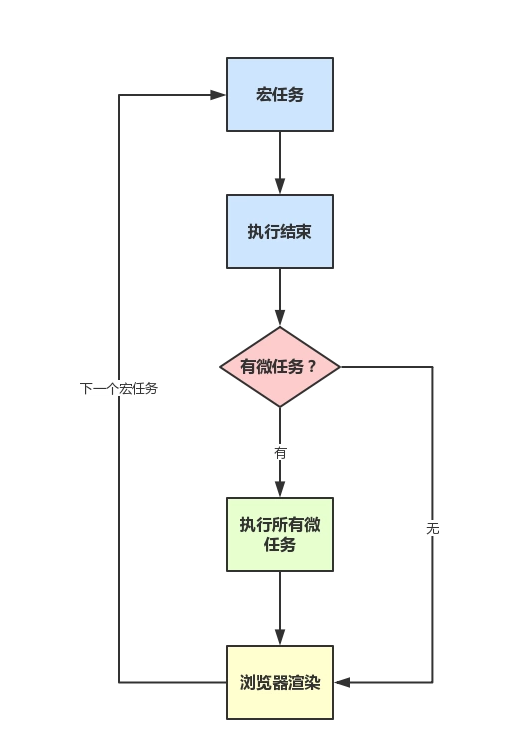

# 一. 宏任务、微任务

  ## 1. 宏任务
  > `（macro） task`，可以理解是每次执行栈执行的代码就是一个宏任务（包括每次从事件队列中获取一个时间回调并放到执行栈中执行）
>
  1. 浏览器为了能能够使JS内部`（macro）task`与DOM任务能够有序的执行，会在一个`（macro）task`执行结束后，在下一个`（macro）task`执行开始前，对页面进行重新渲染，对页面进行重新渲染，流程如下 
  
         (macro)task -> 渲染 -> （macro）task
  
  2.宏任务包括
    
    ```javascript
        script
        setTimeout
        setInterval
        I/O
        UI交互时间
        postMessage
        MessageChannel
        setImmediate （node.js环境）
    ```
    
    
   ## 2. 微任务
   
   > `microtask`可以理解是在当前task执行结束后立即执行的任务，也就是说，在当前task任务后，下一个task执行，在渲染之前。
>
1.所以 `microtask` 的响应速度相比于setTimeout会更快，因为无需等渲染。也就是说，在某一个`macrotask(宏任务)`执行完后，就会将在他执行期间产生的所有`microtask` 都执行完毕（在渲染前）

2.微任务包括

    ```javascript
        Promise.then
        Object.observe
        MutaionObserver
        process.nextTick(node.js环境)
    ```
    
   ## 3. 事件循环运行机制
  > 在事件循环中，每进行一次循环操作称为 tick，每一次 tick 的任务处理模型是比较复杂的，但关键步骤如下：

 * 执行一个宏任务（栈中没有就从事件队列中获取）
 
 * 执行过程中如果遇到微任务，就将它添加到微任务的任务队列中
 * 宏任务执行完毕后，立即执行当前微任务队列中的所有微任务（依次执行）
 * 当前宏任务执行完毕，开始检查渲染，然后GUI线程接管渲染
 * 渲染完毕后，JS线程继续接管，开始下一个宏任务（从事件队列中获取）
 
   


