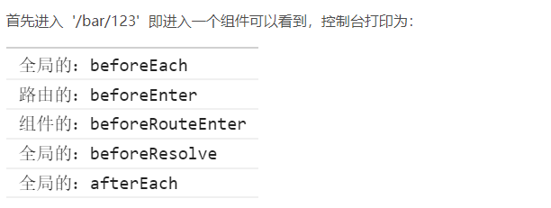
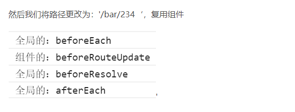
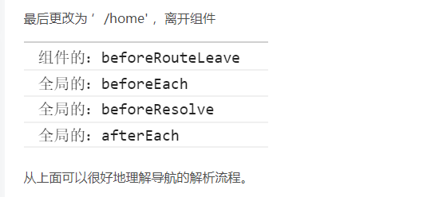

> vue vue-router 各个守卫的详细理解

 ## 导航守卫分类
  导航守卫按照维度分三个：

  - `全局的`：进入任何一个路由都会执行

    beforeEach：进入路由前执行
    beforeResolve：在导航被确认之前，同时在所有组件内守卫和异步路由组件被解析之后，解析守卫就被调用
    afterEach：导航确认执行时执行，可理解为导航完成时执行

  - `路由的`：进入某个路由才会执行

    beforeEnter: 进入该路由前

  - `组件的`：进入某个组件才会执行组件复用时

    beforeRouteEnter： 进入组件时
    beforeRouteUpdate： 组件被复用时调用
    beforeRouteLeave： 离开组件前

## 例子

```javascript

    <!DOCTYPE html>
    <html lang="en">
    <head>
      <meta charset="UTF-8">
      <title>vue-router</title>
      <script src="vue.js"></script>
      <script src="vue-router.js"></script>
    </head>
    <body>
      <div id="app">
        <router-view></router-view>
      </div>
      <script>
        const bar = {
          template: '<div>bar-{{userId}}</div>',
          computed: {
            userId() { return this.$route.params.userId }
          },
          beforeRouteEnter (to, from, next) {
            // 在渲染该组件的对应路由被 confirm 前调用
            // 不！能！获取组件实例 `this`
            // 因为当守卫执行前，组件实例还没被创建
            console.log('beforeRouteEnter')
            next()
          },
          beforeRouteUpdate (to, from, next) {
            // 在当前路由改变，但是该组件被复用时调用
            // 举例来说，对于一个带有动态参数的路径 /foo/:id，在 /foo/1 和 /foo/2 之间跳转的时候，
            // 由于会渲染同样的 Foo 组件，因此组件实例会被复用。而这个钩子就会在这个情况下被调用。
            // 如果不加这个钩子，则路由变化时页面检测不到数据变化
            // 可以访问组件实例 `this`
            console.log('beforeRouteUpdate')
            next()
          },
          beforeRouteLeave (to, from, next) {
            // 导航离开该组件的对应路由时调用
            // 可以访问组件实例 `this`
            console.log('beforeRouteLeave')
            next()
          }
        }
        const error = { template: '<div>oops! error</div>'}
        const home = { template: '<div>this is home</div>'}

        const routes = [
          { path: '/error', component: error },
          { path: '/', component: home },
          // 路由独享守卫，用法与beforeEach一样
          { path: '/bar/:userId', component: bar, beforeEnter: ((to, from, next) => {
              console.log('beforeEnter')
              next()
            })
          }
        ]

        const router = new VueRouter({
          routes
        })

        // 全局前置守卫： 进入to路由前执行
        router.beforeEach((to, from, next) => {
          console.log('beforeEach')
          console.log(to)
          console.log(from)
        // 正常跳转到下一个页面，
          next()
        // 跳转到指定页面
          // 不能直接next('/error')，会陷入死循环 参考https://segmentfault.com/q/1010000012316727q/1010000012316727
          // to.path == '/error' ?  next() : next('/error')
        // 只能停留在当前页面
          // next(false)
        })

        // 全局解析守卫： 在导航被确认之前，同时在所有组件内守卫和异步路由组件被解析之后，解析守卫就被调用
        router.beforeResolve((to, from, next) => {
          console.log('beforeResolve')
          // console.log(to)
          // console.log(from)
          next()
        })

        // 全局后置钩子： 导航被确认执行，可以理解为导航完成时执行
        router.afterEach((to, from) => {
          console.log('afterEach')
          // console.log(to)
          // console.log(from)
        })

        const app = new Vue({
          el: "#app",
          router
        })
      </script>
    </body>
    </html>
```

## 导航守卫的解析流程
  > 在上面的代码中加入了所有的守卫导航函数，下面来看看几种情况导航守卫的解析流程：







- 一些坑总结

  - next()

    对于有 next()的钩子函数

        // 正常跳转到下一个页面，
            next()
        // 跳转到指定页面
            // 不能直接next('/error')，会陷入死循环 参考https://segmentfault.com/q/1010000012316727q/1010000012316727
            to.path == '/error' ?  next() : next('/error')
        // 只能停留在当前页面
            next(false)

  - beforeRouteUpdate()

        如果不加这个钩子，则路由变化时，页面检测不到数据变化：

             beforeRouteUpdate (to, from, next) {
               next()
             }
